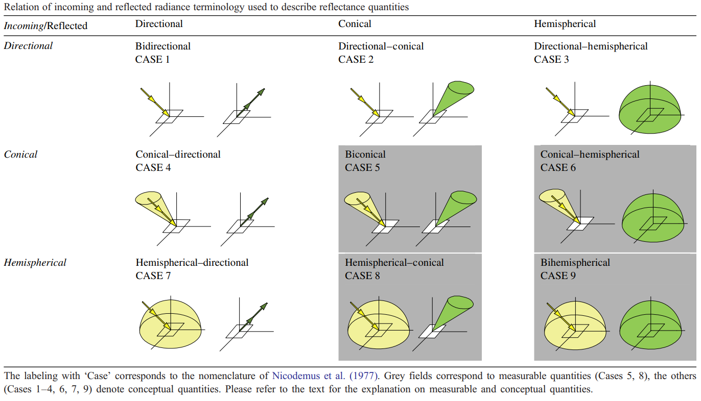

# Reflectance

## reflected_radiance_terminology

From Schaepman-Strub et al. 2006 [^1].

[^1]: G. Schaepman-Strub, M. E. Schaepman, T. H. Painter, S. Dangel, and J. V. Martonchik. Reflectance quantities in optical remote sensing-definitions and case studies. Remote Sens. Environ., 103(1):27–42, 2006. doi:10.1016/j.rse.2006.03.002.