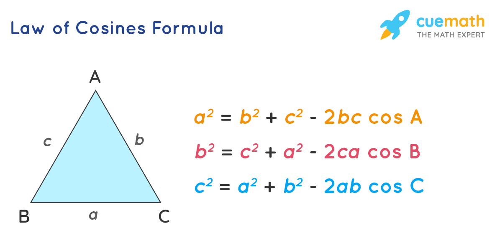

## Geometry

- Area of each triangle (with Heron's formula)
a,b,c为三角形的三条边，s是周长的一半。

$$
s = (a + b + c) / 2,
Area = \sqrt{s(s - a)(s - b)(s - c)}
$$

- Law of Cosines[^1]

[^1]: [law-of-cosine](https://www.cuemath.com/trigonometry/law-of-cosine/)