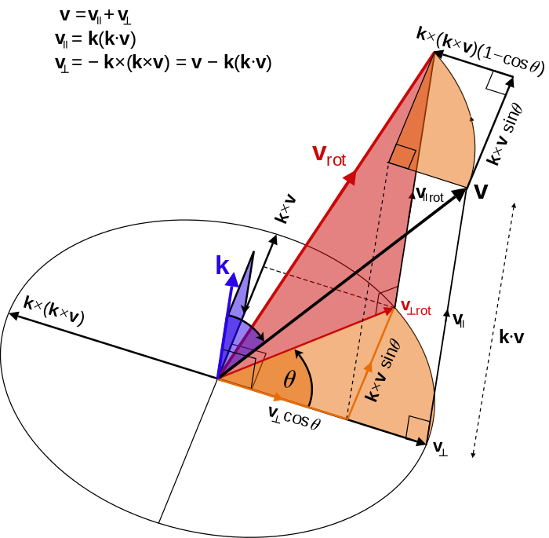

Mathmatics
==========

向量绕任意轴旋转(rotate vector by arbitrary axis)
-------------------------------------------------------
- [Rodrigues' rotation formula](https://en.wikipedia.org/wiki/Rodrigues%27_rotation_formula)
- [vtkMath::RotateVectorByNormalizedQuaternion](https://github.com/Kitware/VTK/blob/master/Common/Core/vtkMath.cxx#L1802)

Chats
-----

